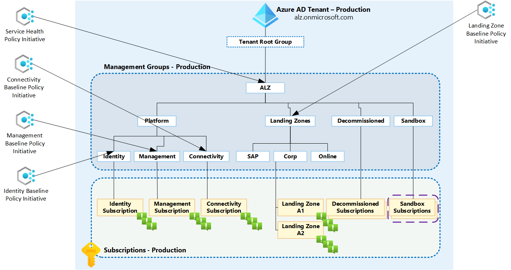

# Module Four Monitoring Linux Workloads in Azure

**Table of content:**

- [Monitoring Consideratiion](#item-one)
- [Monitoring Recommendatons](#item-two)
- [Linux Monitoring Lab](#item-three)
- [Next Steps](#item-four)

## Goal

This session aims to help the Microsoft's technical community better monitor critical Linux workloads on Azure by providing recommended practices and guidance. This session is geared towards using Azure Monitor with Linux virtual machines.

## Prerequisites for this Module

The completion of this module will require access to an active Azure subscription. Is is recommended to have at a minimum contributor access to the subscription for the successful deployment of resources.
<!--heading -->

## Monitoring Considerations

There isn’t definitive list of what you should monitor when you deploy something to Azure because “it depends”, on what services you’re using and how the services are used, which will in turn dictate what you should monitor and what thresholds the metrics you do decide to collect are and what errors you should alert on in logs. the following are some considerations for review.

- Consult with the customer or partner on their current monitoring solution and intent
- Engage with the application owners, architects, and developers to get a firm understanding of the application profile as well as system design limits
- Are there any external dependencies that are critical for the application to operate as intended
- Identify the application personas. Will access come from internal or external networks
- How will users authenticate against the application?
- Review if the customer administration model. Understand the required RBAC roles to implement Azure Monitor. Please review the following guidance [Roles, permissions, and security in Azure Monitor](https://learn.microsoft.com/en-us/azure/azure-monitor/roles-permissions-security)
- Understand the customers industry vertical to validate if there are specific regulatory requirements and monitoring retention required
- Validate name resolution in relation to the Linux workload as well as ancilliary services that interact with the specified workloads
- Has redundancy been implemented in the design and are there any SLA’s?
<!--heading -->
  

## Monitoring Recomendations

The following are some recommendations for review when monitoring Linux workloads in Azure.

- **Implementation:** Implement an initial set of metrics and limit potential “white noise“ and gradually add required counters
- Conduct an initial validation of the monitoring solution and how will it integrate with the current organizational structure
- **Notifications:** Implement email notifications, SMS alerts, Logic Apps, Azure automation runbooks, and ITSM tooling to enable additional capabilities integrating with the customers ticketing system as part of overall monitoring strategy
- **Web Tier:** Integrate Application Insights with your web tier to monitor the performance, availability, and usage of your web applications. This will help you track user interactions and detect anomalies
- **Business Tier:** Use Application Insights to monitor the business logic layer. This includes tracking custom events, exceptions, and performance metrics
- **Data Tier:** Monitor your database performance and query execution times using Azure Monitor or Oracle Enterprise Manager
- **Distributed Tracing:** Use Application Insights to implement distributed tracing. This helps you track requests as they flow through different components of the application, making it easier to diagnose performance issues and failures
- Continuous Improvement: Regularly review the collected data and adjust monitoring strategy as needed. Use the insights gained to optimize the application's performance and reliability
- **Leverage the Azure Monitor Baseline Alerts (AMBA)** This solution accelerator contains a list of recommended Azure Monitor metrics,activity log alert rules, and recommended thrshold values for the Azure Infrastructure platform. The solution can be implemented for an Azure Landing Zone (ALZ) which is either "greenfield" or "brownfield". Please refer to the following for further details [Azure Monitor Baseline Alerts](https://azure.github.io/azure-monitor-baseline-alerts/welcome/).Each of the alert rules documented have been compiled into Azure Policy definitions and these have then been packaged into logical Policy Initiatives based on the ALZ management group structure [Management Groups](https://learn.microsoft.com/en-gb/azure/cloud-adoption-framework/ready/landing-zone/design-area/resource-org-management-groups) as depicted in the below graphic.

<!--heading-->

## Linux Monitoring Lab

In the upcoming lab, participants will engage in deploying resources within Azure, crafting a tailored dashboard, and utilizing Azure Monitor to assess system health. The diagram provided below will illustrate the deployment architecture facilitated by the solution accelerator, which is designed to streamline and expedite the implementation process. You will need to follow the lab in the step by to step for succesful completion.

**Lab instructions**

| Step Number  | Comment                         |
| :----------- | :--------------------------     |
|  1           | Push the Deploy to Azure Button |
|  2           | Your Azure Subscription with a custom populated template should appear on your computer screen screen                                | 

<!--heading-->

## Next Steps
